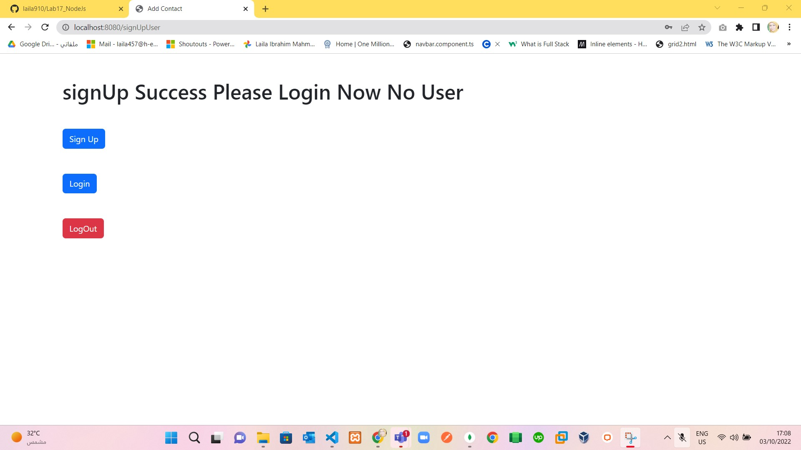

# Part 1
> Using EJS, Express and mongodb create login page , the users data will be stored in
 the monogodb server , use cookies to save the session id.

> Notes:
 1. use `express` , `body-parser` ,`ejs`, `mongodb`, `cookie-parser`,`cors`
 2. create `app.js` for handle login page and its' Data :) and listen to port `8080`.
 3. create 3 ejs pages `index` for home , `login` for login page ,`signup` for add new user.
 4. connect to dataBase.

> Solve : 
  1. Home Page `/` as in : 
   
  
  2. if you click SignUp Button to add new user in Database as in:
   

  3. see you new user (`Ilham`) added in DataBase as in: 
   
 
  4. see your Home page Changed as in:
   

  5. click on login button to login to this user as in: 
   
  
  6. click on login and return to home as in:
   

  7. click on Logout button and see the change in home as in:
   
